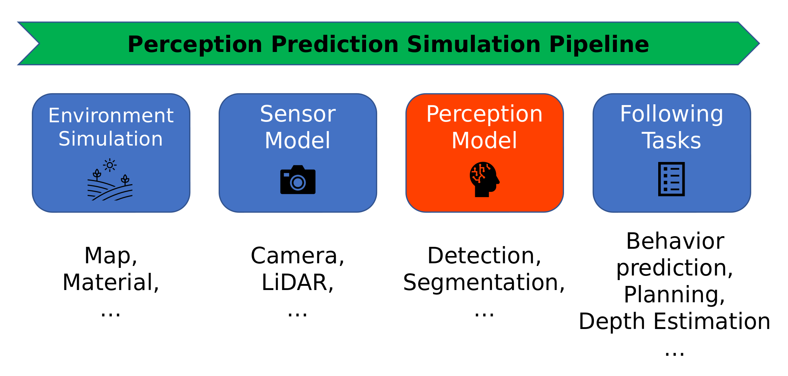

# ModelSimulator

## Introduction



Simulator is an popular method to develop autonomous driving system. With the help of synthesized scenes, infinite data can be generated for system validation. In addition to the traditional basic factors in simulator such as environments and sensors, the deep models used in perception are playing an increasingly important role. 

Here we want to explore the behavior of deep models, and find a solution to simulate their output. Therefore, the demand on data simulation can be decreased, and the information embedded in existing data can be maximize utilized.


## Developing Instruction

Any incremental coding should be added to newly created branch, and wait for merge into master when pass test.


## Usage

The project now can be test by running following Python script


- [x] Get the base line: target model performance on Minist/Cifar10 dataset

```
cd ModelSimulator/analysis/simple_model_evaluation/ 
python get_target_model_statistics.py --cfg_dir xxxx/ModelSimulator/utils/config/samples/sample1 
```

```
cd ModelSimulator/analysis/simple_model_evaluation/ 
python get_target_model_statistics.py --cfg_dir xxxx/ModelSimulator/utils/config/samples/sample1 
```


- [x] Train the vae_gan model to imitate the behavior of  target model on Minist

```
cd ModelSimulator/main 
python train.py --cfg_dir xxxx/ModelSimulator/utils/config/samples/sample3 
```

- [x] Test the trained vae_gan model for imitating the  target model on Minist

```
cd ModelSimulator/main 
python test.py --cfg_dir xxxx/ModelSimulator/utils/config/samples/sample3 
```


- [ ] Train the vae_gan model to imitate the behavior of  target model on Cifar10

```
cd ModelSimulator/main 
python train.py --cfg_dir xxxx/ModelSimulator/utils/config/samples/sample4 
```

- [ ] Test the trained vae_gan model for imitating the  target model on Cifar10

```
cd ModelSimulator/main 
python test.py --cfg_dir xxxx/ModelSimulator/utils/config/samples/sample4 
```

 

- [x] Experimenting on kitti dataset, target model = pretrained pvrcnn  

```
# launch a distributed training, remember to mofify the bash script according to your need
cd ModelSimulator/script 
./slurm_train.sh 
```

